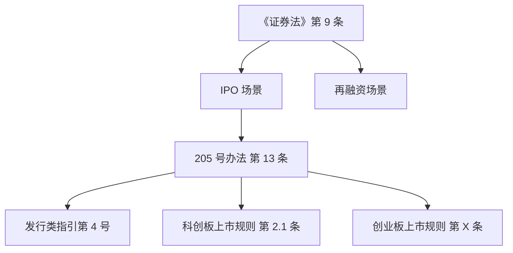

# 中国法律规范效力层级框架（Hierarchy Framework）

本文件为 `ecm-research-reg-study` 提供**效力层级的完整认定框架**，供 Claude 在 Phase 2
（效力层级图）时对齐。

---

## 一、总体层级图

```
                         宪法
                          │
          ┌───────────────┼───────────────┐
          │               │               │
        法律         地方性法规        司法解释
   （全国人大/     （省级人大/       （最高法、
    常委会）        较大的市人大）      最高检）
          │               │
    行政法规         地方政府规章
    （国务院）       （省级/较大的市政府）
          │
    部门规章
    （国务院部委）
          │
  规范性文件（"红头文件"）
    （部委通知/公告）
          │
  交易所业务规则 = "自律规则"
       [独立体系]
```

关键要点：
- **宪法**是最高位阶，但 ECM 实务中直接援引宪法的场合极少
- **法律 > 行政法规 > 部门规章** 是严格位阶
- **规范性文件**位阶低于部门规章，不能与规章冲突；但在实务中仍为重要的审核依据
- **司法解释**是法律适用的权威解释，对各级法院具有**直接约束力**——实务中效力近于法律
- **自律规则**（交易所业务规则）不属于严格法律规范，但通过合同约束市场主体

---

## 二、各层级的授权和权限

### 2.1 法律

- **制定主体**：全国人民代表大会（基本法律）；全国人民代表大会常务委员会（基本法律以外的法律）
- **ECM 领域核心法律**：《公司法》《证券法》《证券投资基金法》《民法典》
- **权限**：只有法律可以对下列事项作出规定——
  - 民事基本制度
  - 刑罚
  - 对公民政治权利的剥夺等
- **冲突规则**：法律不得与宪法冲突

### 2.2 行政法规

- **制定主体**：国务院
- **表现形式**：国务院令、条例、暂行条例、实施办法、规定
- **ECM 相关行政法规**：《期货交易管理条例》《证券公司监督管理条例》等
- **权限**：为执行法律的规定；或法律授权行政法规作出的事项
- **冲突规则**：不得与法律冲突

### 2.3 部门规章

- **制定主体**：国务院部委、直属机构（如证监会、财政部、国资委等）
- **表现形式**：部委令 + 具体办法名
- **ECM 相关证监会规章**：《IPO 注册管理办法》（205 号）、《再融资注册管理办法》（206 号）、
  《上市公司重大资产重组管理办法》（214 号）等
- **权限**：
  - 基于法律、行政法规的明确授权
  - 对本部门管理事项作出具体规定
- **冲突规则**：不得与法律、行政法规冲突；部门规章**之间如有冲突**，由国务院裁决

### 2.4 规范性文件（"红头文件"）

- **制定主体**：部委（或更低级机构）
- **表现形式**：通知、公告、答复、指引、业务指引、工作备忘录、监管问答等
- **效力**：低于部门规章；不得突破规章；但在**规章授权范围内细化**有效力
- **ECM 相关**：《监管规则适用指引》系列、证监会工作备忘录、证监会问答等
- **冲突规则**：
  - 与部门规章冲突 → 规章优先
  - 与上位法冲突 → 上位法优先
  - **实务中常见**：规范性文件对部门规章作出**更严要求**，属于合法授权补充，市场主体须同时遵守

### 2.5 司法解释

- **制定主体**：最高人民法院、最高人民检察院（司法解释）
- **表现形式**：
  - "法释"（最高法）：《关于……若干问题的规定》《……解释》
  - "高检"（最高检）：对应检察业务的解释
- **效力**：对各级法院的审判工作具有**直接约束力**
- **典型 ECM 相关司法解释**：
  - 《关于审理证券市场虚假陈述侵权民事赔偿案件的若干规定》（法释〔2022〕2 号）
  - 《关于适用〈中华人民共和国公司法〉若干问题的规定》（一/二/三/四/五）
  - 《全国法院民商事审判工作会议纪要》（"九民纪要"，2019）——虽是"纪要"形式，但实质具有
    准司法解释效力
- **冲突规则**：
  - 司法解释不得突破法律；法律修订后司法解释自动调整或需要同步修订
  - 司法解释与部门规章冲突时，在**审判权限范围内**，法院按司法解释（但行政机关仍按部门规章
    执法）

### 2.6 交易所业务规则（自律规则）

- **制定主体**：证券交易所、证券业协会
- **表现形式**：上市规则、审核规则、交易规则、业务指南、实施细则、业务办理指引
- **法律性质**：
  - 不属于严格的法律规范（不属于"法律、行政法规、部门规章"任何层级）
  - 本质上是**自律规则**，通过章程、上市合同等约束市场主体
  - 违反自律规则的后果是**自律处分**（公开谴责、通报批评、纪律处分），不是行政处罚
- **效力层级争议**：
  - 学理上属于"自律规范"
  - 监管实务中，交易所规则的要求对市场主体**事实上具有**类规则的约束力
  - 2019 年《证券法》修订后，对交易所规则的授权有所加强（第 97 条）
- **冲突规则**：
  - 与部门规章冲突时，原则上**部门规章优先**（因为交易所规则是基于证监会授权制定的）
  - 但交易所规则**严于规章**的情况（加码）通常视为合法的自律监管，市场主体仍须遵守

### 2.7 地方性法规 / 地方政府规章

- **ECM 相关性**：较低；主要在以下场景触及
  - 涉地方国企上市：地方国资监管规定
  - 涉地方产业政策：地方产业目录
  - 涉地方营商环境：某些地方金融办的规定
- **冲突规则**：上位法优先；不得与国家法律、行政法规冲突

---

## 三、特殊层级的补充说明

### 3.1 国务院决定 / 通知 / 意见

- 性质：介于行政法规和规范性文件之间
- 典型：国务院"若干意见"（如 2024 年"新国九条"）
- 效力：对各级行政机关具有约束力；但对法院一般不直接约束
- **ECM 实务中的地位**：作为**政策指引**和制度改革方向的信号；具体制度落实仍依赖后续
  部门规章和交易所规则

### 3.2 国际条约与国际惯例

- **ECM 中的相关性**：
  - 涉外发行（境外上市备案）时，可能涉及《联合国国际货物销售合同公约》（CISG）等条约
  - 跨境并购可能涉及国际税收协定
- **效力层级**：
  - 中国签订或参加的国际条约，原则上**优于国内法**（相同事项有不同规定时适用条约）
  - 国际惯例仅在国内法无规定时可作为补充适用

### 3.3 "窗口指导" / 内部口径

- 性质：不公开的、通过非正式渠道下发的监管口径
- **严格说不属于法律规范**：没有书面依据、不可公开查证
- **ECM 实务中的影响**：
  - 对具体案件审核有事实上的影响
  - 律师不能将窗口指导作为意见书的正式依据
- 本 skill 处理方式：**不作为法规层级的一部分**；如必须提及，归入"监管实践"而非"法规依据"，
  且标注 C/D 级可靠性

---

## 四、层级关系的实务判断要点

### 4.1 同一主题多层级规范并存

常见情况：某主题同时受《证券法》《部门规章》《规范性文件》《交易所规则》四级规范调整。

**处理原则**：
1. 先确认**上位法**的原则性要求是否得到满足
2. 下位规范是对上位规范的**具体化**——通常累积适用
3. 下位规范**加码**上位规范（更严）——合法授权范围内的加码有效，累积适用
4. 下位规范**缩减**上位规范（更宽）——需警惕超越授权；通常下位规范无效

### 4.2 未明确层级的规范

如"问答"、"备忘录"、"座谈会纪要"等：
- 归入**规范性文件**层级
- 效力取决于是否经正式发布渠道
- 证监会官网正式栏目发布的 → A 级可靠；内部流出的 → D 级不可靠

### 4.3 法律修订后的效力衔接

- 法律修订 → 原行政法规、部门规章**不因法律修订自动失效**，但需按新法进行合法性审查
- 通常由国务院、部委在法律修订后发布**配套办法或修订通知**
- 过渡期的处理：见 [transition-analysis-framework.md](./transition-analysis-framework.md)

---

## 五、实务中常被误解的层级问题

| 误解 | 正解 |
|------|------|
| 交易所规则属于部门规章 | 不是——交易所规则是自律规则，效力层级低于部门规章 |
| 《监管规则适用指引》属于部门规章 | 不是——是规范性文件；可对部门规章做细化，但不得突破 |
| 最高法指导性案例是法律 | 不是法律，但对下级法院有**事实上的约束力** |
| 证监会的窗口指导是正式监管依据 | 不是——没有书面依据，只是事实上影响审核 |
| 国务院"若干意见"是行政法规 | 不是——是政策性文件；效力介于行政法规和规范性文件之间 |
| 九民纪要是司法解释 | 不是严格意义的司法解释；是最高法会议纪要，但具有**准司法解释**效力 |

---

## 六、法源图的输出格式建议

### 格式 A：表格式（通用主题）

```markdown
| 层级 | 法规名称 | 条款 | 对本主题的地位 |
|------|---------|------|---------------|
| 法律 | 《证券法》 | 第 9 条 | 上位法，建立核准/注册原则 |
| 部门规章 | 《IPO 注册管理办法》 | 第 13 条 | 直接依据 |
| 规范性文件 | 《监管规则适用指引——发行类第 4 号》 | 第 X 条 | 对第 13 条的解释性文件 |
| 交易所规则 | 《科创板上市规则》 | 第 2.1 条 | 科创板场景特别要求 |
```

### 格式 B：树状（分支主题）

```markdown
《证券法》第 9 条（上位法，核准/注册原则）
│
├── 适用于 IPO：
│   ├── 《IPO 注册管理办法》205 号 第 13 条（发行条件）
│   │   ├── 《指引——发行类第 2 号》（股权清晰）
│   │   ├── 《指引——发行类第 4 号》（业绩下滑）
│   │   └── 《指引——发行类第 7 号》（境外上市回归）
│   └── 交易所场景：
│       ├── 主板：《上交所/深交所主板上市规则》
│       ├── 科创板：《科创板上市规则》
│       ├── 创业板：《创业板上市规则》
│       └── 北交所：《北交所上市规则》
│
└── 适用于再融资：
    └── 《再融资注册管理办法》206 号 第 XX 条
```

### 格式 C：Mermaid 流程图（复杂主题，需调用 mermaid 渲染）



（使用 Mermaid 时注意渲染环境支持；若不支持则 fallback 到格式 A/B）

---

## 七、层级判断的 fallback

若研究主题涉及不常见层级（例如特定行业监管）或规范性质有争议：

1. **首先查立法机关的官方解释**：全国人大网站的释义、最高法判例中对该规范定性的表述
2. **查学理文献**（仅作参考，C 级）
3. **不作独断结论**：在输出中说明"该规范的层级性质存在学理争议，本研究按通说定性为 XXX"

关键是**不能回避**层级问题——必须为每部法规在法源图中找到位置，并在分析中对其效力边界
作明确陈述。
